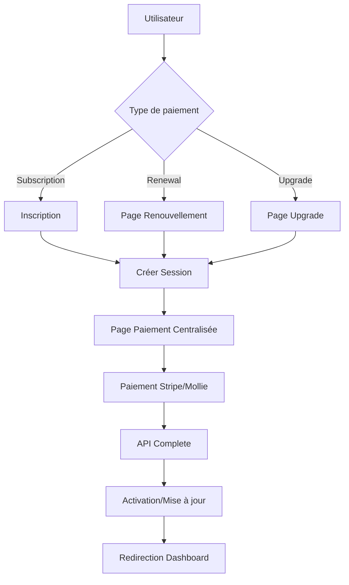

# 🔄 Système de Paiement Restructuré - Vistream

## 📋 Résumé des Modifications

Le système de paiement de Vistream a été entièrement restructuré pour résoudre les problèmes de doublons, améliorer la sécurité et créer une expérience utilisateur fluide.

## 🎯 Problèmes Résolus

1. **Erreur Stripe** : "No payment ID found in result" - Corrigé par l'ajout de `paymentIntentId`
2. **Doublons de paiements** : Prévention via flag `isProcessed`
3. **Redirections excessives** : Flux simplifiés avec sessions
4. **Paramètres URL sensibles** : Remplacés par système de sessions
5. **Scalabilité** : Architecture modulaire pour nouveaux prestataires

## 🆕 Nouveaux Fichiers Créés

### 1. **Page de Paiement Centralisée** (`/auth/payment`)
```
src/app/auth/payment/page.tsx
```
- Interface unifiée pour tous les types de paiements
- Gestion des sessions temporaires
- Support multi-prestataires
- Interface utilisateur moderne

### 2. **API de Session de Paiement** (`/api/payments/session`)
```
src/app/api/payments/session/route.ts
```
- Gestion sécurisée des sessions (1h d'expiration)
- Support pour 3 types : subscription, renewal, upgrade
- Calcul automatique des coûts d'upgrade
- Authentification JWT

### 3. **API de Finalisation** (`/api/payments/complete`)
```
src/app/api/payments/complete/route.ts
```
- Prévention des doublons avec `isProcessed`
- Validation stricte de propriété
- Activation intelligente des abonnements
- Protection contre multiple abonnements actifs

### 4. **Page de Renouvellement** (`/admin/renewal`)
```
src/app/admin/renewal/page.tsx
```
- Interface dédiée pour les renouvellements
- Affichage des détails d'abonnement actuels
- Calcul des jours restants
- Avantages du renouvellement

### 5. **Page d'Upgrade** (`/admin/upgrade`)
```
src/app/admin/upgrade/page.tsx
```
- Interface pour choisir un plan supérieur
- Calcul des coûts d'upgrade
- Comparaison des fonctionnalités
- Protection contre downgrades

## 🔧 Fichiers Modifiés

### 1. **Page d'Abonnement** (`/admin/subscription`)
- Redirections mises à jour vers `/admin/renewal` et `/admin/upgrade`
- Simplification des fonctions de renouvellement

### 2. **Page d'Inscription** (`/auth/signup`)
- Intégration avec l'API `/api/payments/complete`
- Amélioration de la gestion des erreurs
- Support pour `paymentIntentId`

### 3. **Webhook Stripe** (`/api/webhooks/stripe`)
- Amélioration de la prévention des doublons
- Meilleure gestion des upgrades/renouvellements
- Logging amélioré

## 🏗️ Architecture du Nouveau Système

### Types de Paiements Supportés

1. **Subscription** : Nouvel abonnement lors de l'inscription
2. **Renewal** : Renouvellement d'un abonnement existant
3. **Upgrade** : Mise à niveau vers un plan supérieur

### Flux de Paiement



### Gestion des Sessions

- **Stockage** : En mémoire avec nettoyage automatique
- **Expiration** : 1 heure
- **Sécurité** : JWT tokens
- **Données** : Type, planId, userId, subscriptionId

## 🔐 Améliorations de Sécurité

1. **Pas de données sensibles dans les URLs**
2. **Validation de propriété des paiements**
3. **Tokens JWT pour l'authentification**
4. **Prévention des doublons**
5. **Validation stricte des montants**

## 📊 Avantages

### Pour les Utilisateurs
- ✅ Expérience fluide sans redirections multiples
- ✅ Interface moderne et intuitive
- ✅ Pas de risque de double facturation
- ✅ Feedback immédiat sur les erreurs

### Pour les Développeurs
- ✅ Code modulaire et maintenable
- ✅ Ajout facile de nouveaux prestataires
- ✅ Gestion centralisée des erreurs
- ✅ Logs détaillés pour le débogage

### Pour l'Entreprise
- ✅ Réduction des erreurs de paiement
- ✅ Meilleur taux de conversion
- ✅ Support client simplifié
- ✅ Conformité sécuritaire renforcée

## 🚀 Instructions de Déploiement

### 1. Dépendances
```bash
npm install jsonwebtoken @types/jsonwebtoken
```

### 2. Variables d'environnement
Assurer que ces variables sont configurées :
```env
JWT_SECRET=your-secret-key
STRIPE_SECRET_KEY=sk_...
STRIPE_WEBHOOK_SECRET=whsec_...
MOLLIE_API_KEY=live_...
```

### 3. Tests recommandés
1. **Test de signup** : Création compte + paiement
2. **Test de renouvellement** : Depuis `/admin/renewal`
3. **Test d'upgrade** : Depuis `/admin/upgrade`
4. **Test de webhooks** : Stripe et Mollie
5. **Test de sessions** : Expiration et nettoyage

### 4. Monitoring
- Surveiller les logs des APIs `/api/payments/*`
- Vérifier les webhooks reçus
- Contrôler les doublons dans la base de données

## 🔍 Points de Vérification

### Avant le déploiement
- [ ] Variables d'environnement configurées
- [ ] Dépendances installées
- [ ] Tests de paiement en mode test
- [ ] Webhooks configurés correctement

### Après le déploiement
- [ ] Paiements de test fonctionnels
- [ ] Webhooks reçus correctement
- [ ] Pas de doublons créés
- [ ] Redirections correctes

## 🐛 Résolution de Problèmes

### Erreur "No payment ID found"
- **Cause** : Mauvaise extraction de l'ID de paiement
- **Solution** : Vérifier `paymentIntentId` ajouté dans le code

### Sessions expirées
- **Cause** : Session de paiement expirée (>1h)
- **Solution** : Rediriger vers la page de création de nouvelle session

### Doublons de paiements
- **Cause** : Webhook traité plusieurs fois
- **Solution** : Flag `isProcessed` ajouté pour prévention

### Upgrade non effectué
- **Cause** : Erreur dans la logique d'upgrade
- **Solution** : Vérifier les logs dans `/api/payments/complete`

## 📞 Support

Pour toute question ou problème, vérifier :
1. Les logs des APIs dans la console serveur
2. Les webhooks reçus dans le dashboard Stripe/Mollie
3. L'état des sessions dans l'API
4. Les données d'abonnement en base de données 